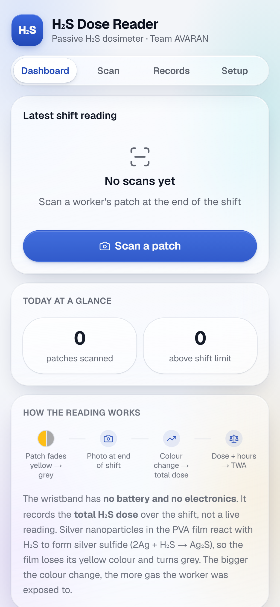
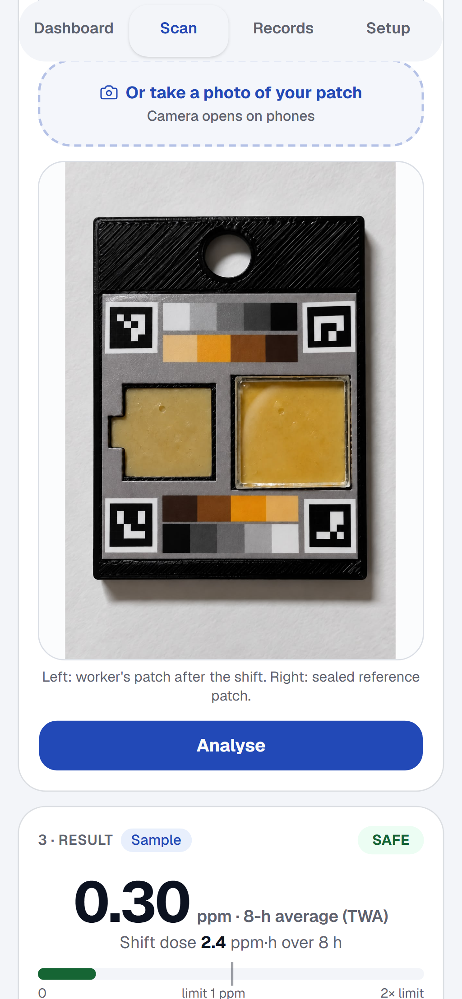
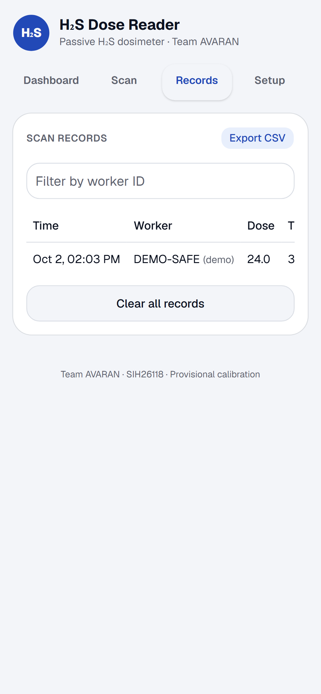
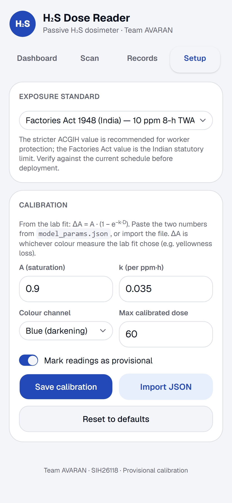

# H₂S Dose Reader

Phone app for the AVARAN passive H₂S dosimeter wristband — Smart India Hackathon 2026, problem statement **SIH26118** (MRPL).

All rights reserved, Team AVARAN. No open-source license has been chosen yet.

## Screenshots

| Dashboard | Scan | Records | Setup |
|---|---|---|---|
|  |  |  |  |

## How it works

The wristband carries a silver-nanoparticle patch that has no battery and no electronics. Over a shift, the patch reacts with ambient H₂S (2Ag + H₂S → Ag₂S) and **fades from yellow to grey** — the colour change is proportional to the worker's cumulative exposure.

At the end of the shift, a supervisor photographs the patch cartridge alongside a white reference card and a sealed (unexposed) reference patch. The app measures the colour change between the reference and the worker's patch, runs it through a calibration curve fitted in the lab, and converts it into:

- **Dose** (ppm·h) — the cumulative H₂S exposure over the shift
- **TWA** (ppm) — dose ÷ shift hours, the 8-hour time-weighted average

The TWA is compared against a configurable exposure standard (ACGIH TLV, 1 ppm, or the Indian Factories Act 1948, 10 ppm) and classified as SAFE, CAUTION, OVER LIMIT, or HIGH.

The app never shows a live or instantaneous reading — only cumulative dose and TWA, consistent with how the physical device actually works.

## Features

- **Sample patches**: Safe, Caution and Over-limit photos of real AVARAN wristband patches show what each band looks like and the dose/TWA reading it maps to.
- **Your own photo**: accepted, but the app explains that the calibrated model is still being built (no ppm estimate yet).
- **Demo images**: Safe/Caution/Over-limit buttons generate a synthetic patch photo by running the *actual* calibration forward, so the demo exercises the real analysis pipeline rather than showing a fabricated result. Demo scans are labelled "demo" everywhere they appear.
- **Records**: a running log of scans with CSV export.
- **Calibration import**: load `model_params.json` from the lab fit script, supporting all 10 colour metrics it can produce (plain darkening and Kubelka-Munk on R/G/B/Luminance, yellowness loss, and total colour change ΔE).
- **Offline PWA**: installable, works after the first load with no network connection — built for plant floors with poor signal.

## Run locally

```bash
npm install
npm run dev      # http://localhost:3000
npm test         # unit tests (Vitest)
npm run build    # static export to out/
```

## Deploy

Static export hosted on Netlify. `netlify.toml` builds with `npm run build` and publishes `out/`.

## Status

**Prototype.** Calibration is **provisional** until laboratory validation is complete (shown in-app until turned off). This is not a certified safety instrument — do not use it as the sole basis for worker-safety decisions.

## Privacy

All data — scans, calibration, records — stays in the browser's `localStorage` on the device. Nothing is uploaded; there is no backend or analytics in this version.

## Team

Team AVARAN, Amity University Noida.

## Known issues

- `npm audit` flags one high/moderate advisory in `postcss`, a transitive dependency of Next.js. It only runs at build time against our own known CSS, never against visitor input (the site is a static export), so the practical risk is very low. The suggested fix upgrades to Next.js 16, a breaking change we're deferring until after the hackathon submission.
